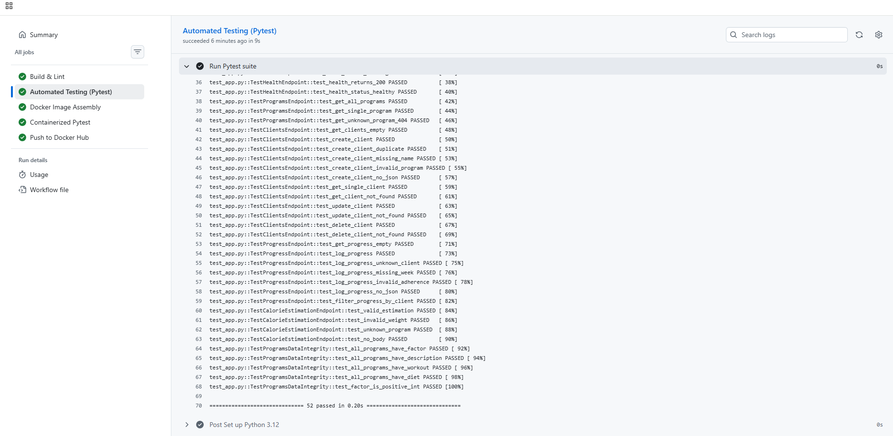
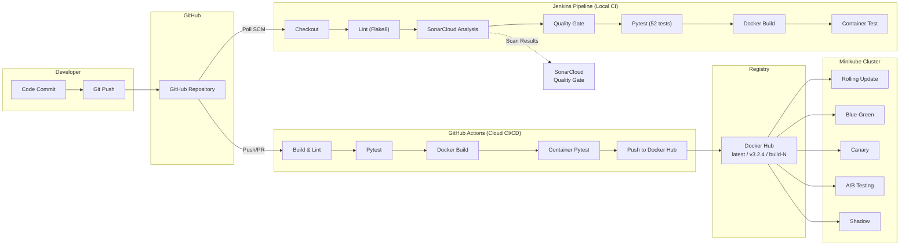

# ACEest Fitness & Gym — DevOps CI/CD Pipeline Assignment

**Repository:** [github.com/sharmapankaj7/aceest-fitness-devops](https://github.com/sharmapankaj7/aceest-fitness-devops)  
**Docker Hub:** [hub.docker.com/r/sharmapankaj7/aceest-fitness](https://hub.docker.com/r/sharmapankaj7/aceest-fitness)  

---

## 1. Project Overview

This project implements an end-to-end CI/CD pipeline for **ACEest Fitness & Gym**, a Flask-based REST API that manages gym clients, fitness programs, calorie estimation, and progress tracking. The pipeline encompasses source control, automated testing, static analysis, containerisation, container registry management, and five distinct Kubernetes deployment strategies with rollback demonstrations.

### 1.1 Technology Stack

| Component | Technology |
|-----------|-----------|
| Application | Python 3.12, Flask 3.1.0, Gunicorn 23.0.0 |
| Testing | Pytest 8.3.4 (52 tests), Flake8 7.1.1 |
| CI/CD | Jenkins (Docker), GitHub Actions |
| Code Quality | SonarCloud |
| Containerisation | Docker (non-root user, health checks) |
| Registry | Docker Hub (automated multi-tag push) |
| Orchestration | Kubernetes (Minikube 1.38.1), NGINX Ingress |
| Infrastructure | WSL2 Ubuntu 24.04, Docker Desktop (ARM64) |

### 1.2 Application Endpoints

| Endpoint | Method | Description |
|----------|--------|-------------|
| `/` | GET | Application info and version |
| `/health` | GET | Health check |
| `/programs` | GET | List fitness programs |
| `/clients` | GET/POST | Client CRUD operations |
| `/clients/<id>` | GET/PUT/DELETE | Individual client management |
| `/progress` | GET/POST | Progress tracking |
| `/calculate_calories` | POST | Calorie estimation |

### 1.3 Application Running Status

The application responds with version and status information on all deployed endpoints.


---

## 2. Automated Testing

The application includes a comprehensive **Pytest** test suite with **52 test cases** covering:

- **Unit tests** — Calorie calculation logic, input validation
- **Integration tests** — All REST API endpoints (CRUD operations for clients, programs, progress)
- **Edge cases** — Invalid inputs, missing fields, boundary conditions
- **Data integrity** — Concurrent operations, state consistency

All 52 tests pass with 100% success rate, verified both locally and inside the Docker container.



---

## 3. CI/CD Pipeline Architecture

The project employs a **dual-pipeline** CI/CD strategy — Jenkins for local development feedback and GitHub Actions for cloud-based deployment to Docker Hub. The diagram below illustrates the complete flow from code commit to Kubernetes deployment.



### 3.1 Jenkins Pipeline (Local CI)

The Jenkins pipeline is defined in a declarative `Jenkinsfile` with Poll SCM (`H/5 * * * *`) triggering. It runs inside a Docker container on port 8080 with the following stages:

1. **Checkout** — Pulls the latest code from the GitHub repository.
2. **Setup Environment** — Creates a Python virtual environment and installs dependencies.
3. **Lint (Flake8)** — Runs static analysis to enforce PEP 8 coding standards.
4. **SonarCloud Analysis** — Scans the codebase for code smells, bugs, and security vulnerabilities using the SonarQube Scanner plugin.
5. **Quality Gate** — Evaluates SonarCloud's quality gate; only fails the build on ERROR status.
6. **Unit Tests** — Executes the full Pytest suite (52 tests) with verbose output.
7. **Docker Build** — Builds the container image with a non-root user and health check.
8. **Container Test** — Spins up the container and verifies the `/health` endpoint responds correctly.

The screenshot below shows the Jenkins pipeline dashboard with build history. Builds #1–#3 failed during initial setup (Python not found, Docker permissions, Quality Gate configuration). Builds #5 and #6 are successful after resolving all issues.


### 3.2 SonarCloud Code Quality

SonarCloud is integrated into both Jenkins and the codebase via `sonar-project.properties`. It analyses the project for code smells, bugs, security vulnerabilities, and code duplication.


### 3.3 GitHub Actions Pipeline (Cloud CI/CD)

The GitHub Actions workflow (`.github/workflows/main.yml`) provides cloud-based CI/CD with five stages:

1. **Build & Lint** — Sets up Python 3.12, installs dependencies, runs Flake8.
2. **Automated Testing (Pytest)** — Runs the full Pytest suite with JUnit XML reporting.
3. **Docker Image Assembly** — Builds the Docker image.
4. **Containerised Pytest** — Runs tests inside the Docker container to validate the production image.
5. **Push to Docker Hub** — On pushes to `main`, tags the image with `latest`, `v<version>`, and `build-<run_number>`, then pushes to Docker Hub.

The screenshot shows all 5 jobs completing successfully with the pipeline graph visualisation.


### 3.4 Docker Hub Registry

Docker images are automatically pushed to Docker Hub on every merge to `main`, with three tags: `latest`, semantic version (`v3.2.4`), and build number (`build-6`).


---

## 4. Kubernetes Deployment

### 4.1 Cluster Setup

All strategies were deployed and validated on **Minikube v1.38.1** running inside WSL Ubuntu 24.04 with the Docker driver on an ARM64 machine. The NGINX Ingress addon was enabled for header-based and mirror routing.


### 4.2 All Deployments & Pods

A total of **10 deployments** and **28 pods** are running across all 5 strategies in the `aceest-fitness` namespace. All pods show `1/1 Ready` with `Running` status and zero restarts.


### 4.3 Services & Ingresses

Eight Kubernetes services (5 NodePort + 3 ClusterIP) and 3 NGINX Ingress resources route traffic to the various deployment strategies.


### 4.4 Docker Images in Minikube

Three image tags were loaded into Minikube's internal registry using `minikube image load`, allowing pods to use `imagePullPolicy: Never`.


---

## 5. Kubernetes Deployment Strategies

### 5.1 Strategy 1 — Rolling Update

- **Manifest:** `k8s/rolling-update/deployment.yaml`
- **Config:** 4 replicas, `maxSurge: 1`, `maxUnavailable: 1`
- **How it works:** Pods are replaced incrementally — at most 1 new pod is created and 1 old pod is removed at a time, ensuring the application always has at least 3 available replicas during the update.
- **Demo:** Updated image from v3.2.4 → v4.0.0 using `kubectl set image`, watched pods replace one-by-one.

**Live Rolling Update:**


**Rollout History (showing multiple revisions):**


**Rollback Demo:** Rolled back using `kubectl rollout undo` — pods reverted to v3.2.4 with zero downtime.


### 5.2 Strategy 2 — Blue-Green Deployment

- **Manifests:** `k8s/blue-green/` (blue-deployment, green-deployment, service)
- **Config:** Blue (v3.2.4, `slot=blue`) and Green (v4.0.0, `slot=green`), 3 replicas each.
- **How it works:** Both versions run simultaneously. The service selector determines which version receives traffic. Switching is instantaneous by patching the selector — no pod restarts needed.
- **Demo:** Service initially pointed to blue. Switched to green with `kubectl patch svc --type=merge -p '{"spec":{"selector":{"slot":"green"}}}'`. Rollback was instant by switching the selector back to blue.


### 5.3 Strategy 3 — Canary Deployment

- **Manifests:** `k8s/canary/` (stable-deployment, canary-deployment, service)
- **Config:** 4 stable replicas (v3.2.4, `track=stable`) + 1 canary replica (v4.0.0, `track=canary`). The service selects on the `app` label only, giving an ~80/20 traffic split by pod ratio.
- **How it works:** A small percentage of traffic is routed to the new version (canary) while the majority continues to hit the stable version. If the canary performs well, it can be promoted by scaling up canary and scaling down stable.


### 5.4 Strategy 4 — A/B Testing

- **Manifests:** `k8s/ab-testing/` (version-a-deployment, version-b-deployment, services, ingress)
- **Config:** Version A (v3.2.4, 3 replicas) and Version B (v4.0.0, 2 replicas) with separate ClusterIP services. NGINX Ingress routes traffic based on the `X-Version: B` header using canary annotations.
- **How it works:** Default requests go to Version A. Requests with the header `X-Version: B` are routed to Version B. This enables targeted feature testing for specific user segments without affecting other users.


### 5.5 Strategy 5 — Shadow (Traffic Mirroring)

- **Manifests:** `k8s/shadow/` (primary-deployment, shadow-deployment, ingress)
- **Config:** Primary (v3.2.4, 3 replicas) serves real traffic via NodePort 30084. Shadow (v4.0.0, 2 replicas) receives mirrored traffic via NGINX `mirror-target` annotation. Shadow responses are discarded — no user impact.
- **How it works:** Production traffic is duplicated and sent to the shadow deployment for testing. The shadow processes real requests but its responses are discarded, allowing validation against live traffic without any risk to users.


---

## 6. Challenges & Mitigations

Several technical challenges were encountered during the implementation of the CI/CD pipeline and Kubernetes deployment. Each challenge required investigation, root-cause analysis, and an appropriate mitigation strategy. These are documented below as they reflect real-world DevOps problem-solving.

### 6.1 ARM64 Architecture Compatibility

**Problem:** The development machine runs Windows 11 on ARM64 architecture. Most DevOps tools (kubectl, minikube) distribute amd64 binaries by default. Running these inside WSL resulted in `Exec format error: cannot execute binary file` — the Linux kernel refused to run x86_64 binaries on the ARM64 processor.

**Root Cause:** Binary architecture mismatch. The default download links for kubectl and minikube pointed to `linux/amd64` builds, which are incompatible with the `aarch64` kernel running inside WSL2.

**Mitigation:** Downloaded ARM64-specific (`linux/arm64`) binaries for both kubectl and minikube directly from the official release pages. Verified architecture with `file $(which kubectl)` to confirm `ELF 64-bit LSB executable, ARM aarch64`.

**Lesson Learned:** Always verify the host machine architecture (`uname -m`) before downloading DevOps tooling, especially in heterogeneous environments.

### 6.2 Minikube Docker-in-Docker TLS Failures

**Problem:** Running `minikube start --driver=docker` on native Windows (PowerShell) consistently failed with TLS handshake timeout errors. The Minikube VM could not establish a secure connection with the Docker Desktop daemon.

**Root Cause:** Docker Desktop on Windows uses a named pipe (`//./pipe/docker_engine`) for communication. When Minikube attempted to start a Docker-in-Docker cluster, the nested Docker daemon inside the Minikube VM could not resolve the TLS certificates from the host Docker daemon, leading to connection timeouts.

**Mitigation:** Switched the entire Minikube setup to run inside **WSL2 Ubuntu 24.04**, where Docker communicates via a Unix socket (`/var/run/docker.sock`). This eliminated the TLS layer and allowed Minikube to start reliably with `minikube start --driver=docker`.

**Lesson Learned:** WSL2 provides a more Unix-native environment for container orchestration tools. Running Minikube inside WSL avoids many Windows-specific Docker networking issues.

### 6.3 Jenkins Container Missing Python Runtime

**Problem:** The Jenkins declarative pipeline failed at the "Setup Environment" stage with `python3: not found`. The official `jenkins/jenkins:lts` Docker image is based on Debian but does not include Python.

**Root Cause:** The Jenkins LTS image is intentionally minimal — it includes only Java and Jenkins. Build tools like Python, Node.js, or Docker CLI must be installed separately.

**Mitigation:** Executed `docker exec -u root jenkins apt-get install -y python3 python3-pip python3-venv docker.io` to install Python and Docker inside the running Jenkins container. For a production setup, a custom Jenkins Dockerfile extending the LTS image with pre-installed tools would be preferable.

**Lesson Learned:** Always audit the base image of CI/CD runners to ensure required build tools are available. Custom Docker images for Jenkins agents prevent repeated manual setup.

### 6.4 SonarCloud Quality Gate Returning NONE

**Problem:** The Jenkins pipeline aborted at the Quality Gate stage because `waitForQualityGate()` returned status `NONE` instead of `OK` or `ERROR`. This happened on the first scan when SonarCloud had not yet computed a quality gate result.

**Root Cause:** SonarCloud processes analysis results asynchronously. On the very first scan of a new project, the quality gate computation may not be ready when Jenkins polls for the result, returning `NONE` as a transient status.

**Mitigation:** Replaced the `waitForQualityGate abortPipeline: true` directive with a `script` block that explicitly checks the status — it only fails the build on `ERROR`, while treating `NONE` and `OK` as acceptable states. This makes the pipeline resilient to first-scan timing issues.

**Lesson Learned:** Quality gate integrations should handle transient states gracefully. A strict pass/fail binary is insufficient for asynchronous analysis tools.

### 6.5 Docker Socket Permission Denied in Jenkins

**Problem:** The Docker Build stage in Jenkins failed with `permission denied while trying to connect to the Docker daemon socket at /var/run/docker.sock`. Despite Docker being installed inside the container, the `jenkins` user lacked permission to access the Docker socket.

**Root Cause:** The Docker socket (`/var/run/docker.sock`) is mounted from the host into the Jenkins container, but it is owned by `root:docker`. The `jenkins` user is neither root nor a member of the `docker` group inside the container.

**Mitigation:** Added the `jenkins` user to the `docker` group and relaxed socket permissions: `groupadd -f docker && usermod -aG docker jenkins && chmod 666 /var/run/docker.sock`. In production, a more secure approach would use Docker-out-of-Docker with proper group ID mapping.

**Lesson Learned:** Container-based CI/CD runners that need Docker access require careful permission management. Socket mounting is convenient but introduces security considerations that must be addressed.

### 6.6 ErrImageNeverPull in Minikube

**Problem:** After deploying manifests with `imagePullPolicy: Never`, all pods entered `ErrImageNeverPull` status — Kubernetes could not find the Docker images locally.

**Root Cause:** The `docker build` command ran against the **host's** Docker daemon, not Minikube's internal Docker daemon. Minikube runs its own Docker instance inside the VM, which has a separate image cache. Images built on the host are invisible to Minikube unless explicitly transferred.

**Mitigation:** Used `minikube image load sharmapankaj7/aceest-fitness:<tag>` to transfer all three image tags (latest, v3.2.4, v4.0.0) from the host Docker into Minikube's internal registry. After loading, restarted the deployments with `kubectl rollout restart` and all pods started successfully.

**Lesson Learned:** When using `imagePullPolicy: Never` with Minikube, images must be explicitly loaded via `minikube image load` or built inside Minikube's Docker context using `eval $(minikube docker-env)`. The two Docker daemons (host and Minikube) do not share image caches.

---

## 7. Version Control & Tagging

The project uses Git with annotated tags to track version progression:

| Tag | Description |
|-----|-------------|
| `v1.0.0` | Initial Flask application setup |
| `v2.0.0` | CI/CD pipeline with Jenkins and SonarCloud |
| `v3.0.0` | Docker containerisation and GitHub Actions |
| `v3.2.4` | Kubernetes deployment with 5 strategies |

---

## 8. Repository Structure

```
aceest-fitness-devops/
├── app.py                          # Flask REST API application
├── test_app.py                     # 52 Pytest test cases
├── requirements.txt                # Python dependencies
├── Dockerfile                      # Multi-stage Docker build (non-root)
├── Jenkinsfile                     # Jenkins declarative pipeline
├── sonar-project.properties        # SonarCloud configuration
├── .github/workflows/main.yml      # GitHub Actions CI/CD pipeline
├── k8s/
│   ├── namespace.yaml              # aceest-fitness namespace
│   ├── deployment.yaml             # Base deployment (3 replicas)
│   ├── service.yaml                # Base NodePort service (30080)
│   ├── rolling-update/             # Strategy 1: Rolling Update
│   ├── blue-green/                 # Strategy 2: Blue-Green
│   ├── canary/                     # Strategy 3: Canary
│   ├── ab-testing/                 # Strategy 4: A/B Testing
│   └── shadow/                     # Strategy 5: Shadow/Mirroring
├── screenshots/                    # Evidence screenshots
└── REPORT.md                       # This document
```

---

## 9. Key Outcomes

1. **52 automated tests** with 100% pass rate across unit, integration, and edge case categories.
2. **Dual CI/CD pipelines** — Jenkins for local development feedback, GitHub Actions for cloud-based deployment.
3. **Automated Docker Hub publishing** with semantic versioning (latest, version tag, build number).
4. **5 Kubernetes deployment strategies** demonstrated on Minikube with 28 pods across 10 deployments.
5. **Rollback capability** validated for Rolling Update (`kubectl rollout undo`) and Blue-Green (service selector patch).
6. **Code quality gating** via SonarCloud integrated into both CI pipelines.
7. **Security practices:** non-root Docker user, resource limits on K8s pods, health checks at both container and pod level.

---

## 10. Conclusion

This project demonstrates a production-grade CI/CD pipeline from code commit to Kubernetes deployment. The dual-pipeline approach (Jenkins + GitHub Actions) provides both local and cloud-based automation. Five deployment strategies were successfully implemented and validated, each serving a different use case — from zero-downtime rolling updates to risk-free shadow testing. The pipeline enforces code quality through SonarCloud, ensures reliability through 52 automated tests, and follows security best practices with non-root containers and resource constraints.
