# ACEest Fitness & Gym — DevOps CI/CD Pipeline Assignment

**Course:** BITS Pilani — DevOps  
**Student:** Pankaj Sharma  
**Date:** April 2026  
**Repository:** [github.com/sharmapankaj7/aceest-fitness-devops](https://github.com/sharmapankaj7/aceest-fitness-devops)  
**Docker Hub:** [hub.docker.com/r/sharmapankaj7/aceest-fitness](https://hub.docker.com/r/sharmapankaj7/aceest-fitness)  

---

## 1. Project Overview

This project implements an end-to-end CI/CD pipeline for **ACEest Fitness & Gym**, a Flask-based REST API that manages gym clients, fitness programs, calorie estimation, and progress tracking. The pipeline encompasses source control, automated testing, static analysis, containerisation, container registry management, and five distinct Kubernetes deployment strategies with rollback demonstrations.

### 1.1 Technology Stack

| Component | Technology |
|-----------|-----------|
| Application | Python 3.12, Flask 3.1.0, Gunicorn 23.0.0 |
| Testing | Pytest 8.3.4 (52 tests), Flake8 7.1.1 |
| CI/CD | Jenkins (Docker), GitHub Actions |
| Code Quality | SonarCloud |
| Containerisation | Docker (non-root user, health checks) |
| Registry | Docker Hub (automated multi-tag push) |
| Orchestration | Kubernetes (Minikube 1.38.1), NGINX Ingress |
| Infrastructure | WSL2 Ubuntu 24.04, Docker Desktop (ARM64) |

### 1.2 Application Endpoints

| Endpoint | Method | Description |
|----------|--------|-------------|
| `/` | GET | Application info and version |
| `/health` | GET | Health check |
| `/programs` | GET | List fitness programs |
| `/clients` | GET/POST | Client CRUD operations |
| `/clients/<id>` | GET/PUT/DELETE | Individual client management |
| `/progress` | GET/POST | Progress tracking |
| `/calculate_calories` | POST | Calorie estimation |

### 1.3 Application Running Status

The application responds with version and status information on all deployed endpoints.

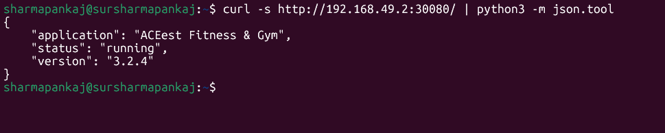

---

## 2. CI/CD Pipeline Architecture

### 2.1 Jenkins Pipeline (Local CI)

The Jenkins pipeline is defined in a declarative `Jenkinsfile` with Poll SCM (`H/5 * * * *`) triggering. It runs inside a Docker container on port 8080 with the following stages:

1. **Checkout** — Pulls the latest code from the GitHub repository.
2. **Setup Environment** — Creates a Python virtual environment and installs dependencies.
3. **Lint (Flake8)** — Runs static analysis to enforce PEP 8 coding standards.
4. **SonarCloud Analysis** — Scans the codebase for code smells, bugs, and security vulnerabilities using the SonarQube Scanner plugin.
5. **Quality Gate** — Evaluates SonarCloud's quality gate; only fails the build on ERROR status.
6. **Unit Tests** — Executes the full Pytest suite (52 tests) with verbose output.
7. **Docker Build** — Builds the container image with a non-root user and health check.
8. **Container Test** — Spins up the container and verifies the `/health` endpoint responds correctly.

The screenshot below shows the Jenkins pipeline dashboard with build history. Builds #1–#3 failed during initial setup (Python not found, Docker permissions, Quality Gate configuration). Builds #5 and #6 are successful after resolving all issues.

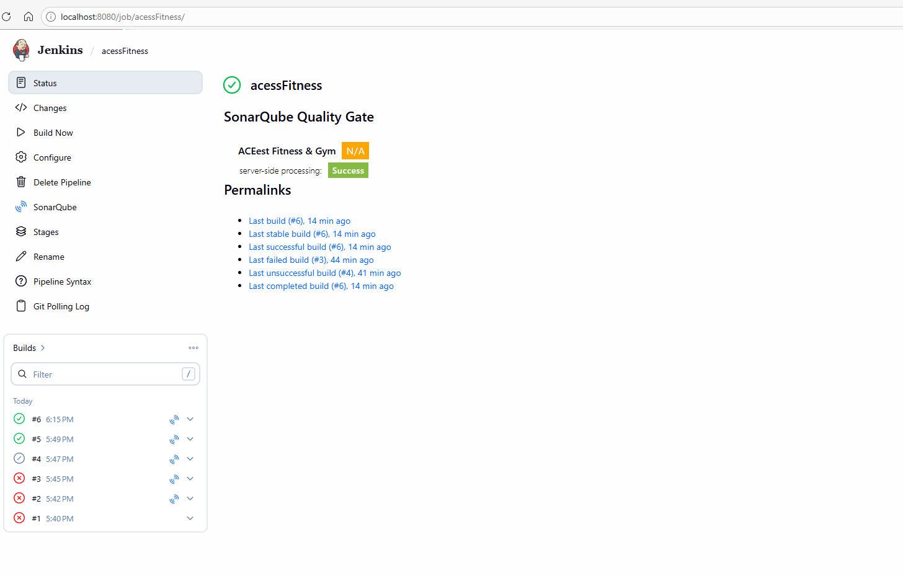

### 2.2 SonarCloud Code Quality

SonarCloud is integrated into both Jenkins and the codebase via `sonar-project.properties`. It analyses the project for code smells, bugs, security vulnerabilities, and code duplication.

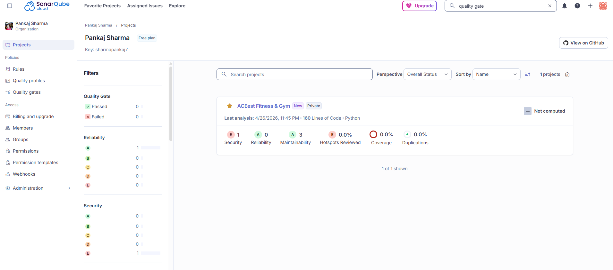

### 2.3 GitHub Actions Pipeline (Cloud CI/CD)

The GitHub Actions workflow (`.github/workflows/main.yml`) provides cloud-based CI/CD with five stages:

1. **Build & Lint** — Sets up Python 3.12, installs dependencies, runs Flake8.
2. **Automated Testing (Pytest)** — Runs the full Pytest suite with JUnit XML reporting.
3. **Docker Image Assembly** — Builds the Docker image.
4. **Containerised Pytest** — Runs tests inside the Docker container to validate the production image.
5. **Push to Docker Hub** — On pushes to `main`, tags the image with `latest`, `v<version>`, and `build-<run_number>`, then pushes to Docker Hub.

The screenshot shows all 5 jobs completing successfully with the pipeline graph visualisation.

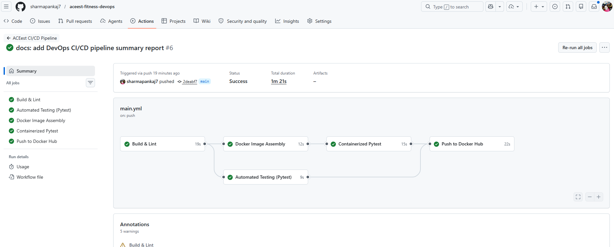

### 2.4 Docker Hub Registry

Docker images are automatically pushed to Docker Hub on every merge to `main`, with three tags: `latest`, semantic version (`v3.2.4`), and build number (`build-6`).

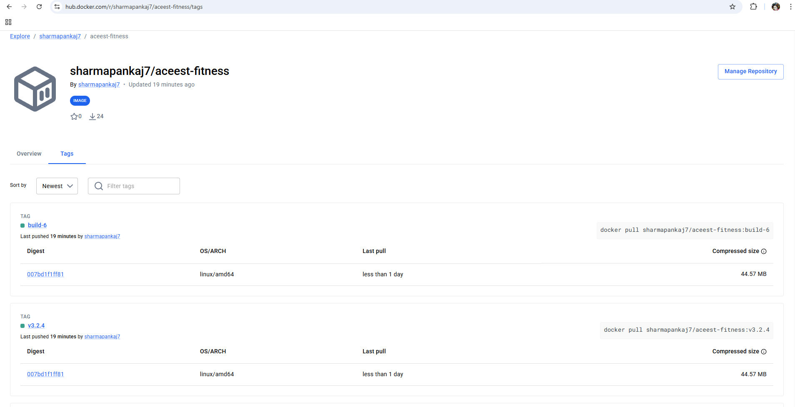

---

## 3. Kubernetes Deployment

### 3.1 Cluster Setup

All strategies were deployed and validated on **Minikube v1.38.1** running inside WSL Ubuntu 24.04 with the Docker driver on an ARM64 machine. The NGINX Ingress addon was enabled for header-based and mirror routing.

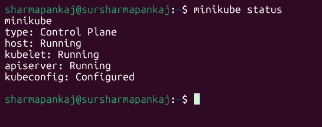

### 3.2 All Deployments & Pods

A total of **10 deployments** and **28 pods** are running across all 5 strategies in the `aceest-fitness` namespace. All pods show `1/1 Ready` with `Running` status and zero restarts.

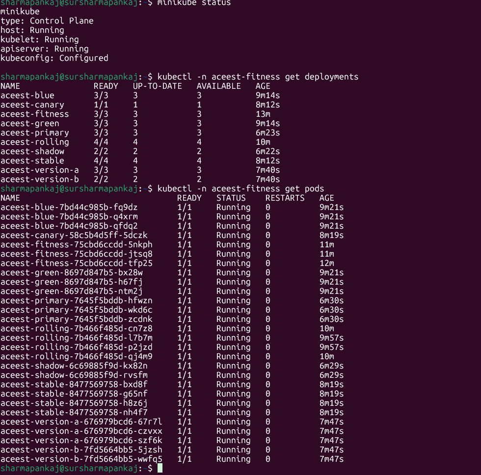

### 3.3 Services & Ingresses

Eight Kubernetes services (5 NodePort + 3 ClusterIP) and 3 NGINX Ingress resources route traffic to the various deployment strategies.

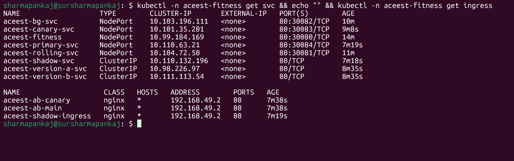

### 3.4 Docker Images in Minikube

Three image tags were loaded into Minikube's internal registry using `minikube image load`, allowing pods to use `imagePullPolicy: Never`.

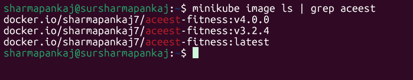

---

## 4. Kubernetes Deployment Strategies

### 4.1 Strategy 1 — Rolling Update

- **Manifest:** `k8s/rolling-update/deployment.yaml`
- **Config:** 4 replicas, `maxSurge: 1`, `maxUnavailable: 1`
- **How it works:** Pods are replaced incrementally — at most 1 new pod is created and 1 old pod is removed at a time, ensuring the application always has at least 3 available replicas during the update.
- **Demo:** Updated image from v3.2.4 → v4.0.0 using `kubectl set image`, watched pods replace one-by-one.

**Live Rolling Update:**

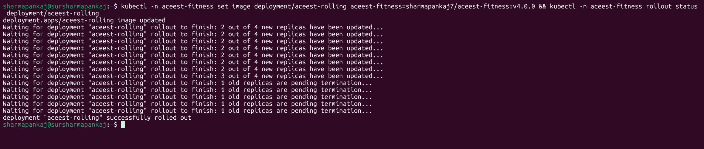

**Rollout History (showing multiple revisions):**

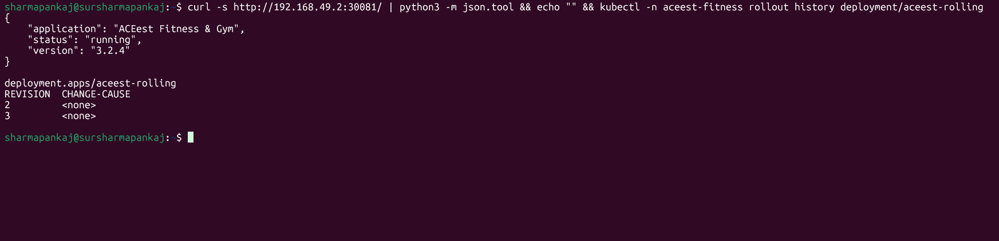

**Rollback Demo:** Rolled back using `kubectl rollout undo` — pods reverted to v3.2.4 with zero downtime.

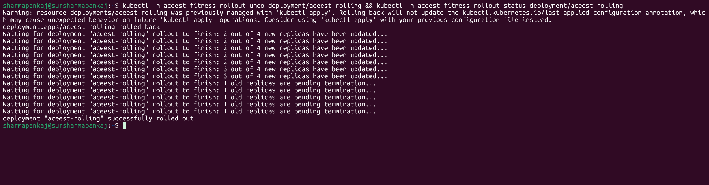

### 4.2 Strategy 2 — Blue-Green Deployment

- **Manifests:** `k8s/blue-green/` (blue-deployment, green-deployment, service)
- **Config:** Blue (v3.2.4, `slot=blue`) and Green (v4.0.0, `slot=green`), 3 replicas each.
- **How it works:** Both versions run simultaneously. The service selector determines which version receives traffic. Switching is instantaneous by patching the selector — no pod restarts needed.
- **Demo:** Service initially pointed to blue. Switched to green with `kubectl patch svc --type=merge -p '{"spec":{"selector":{"slot":"green"}}}'`. Rollback was instant by switching the selector back to blue.

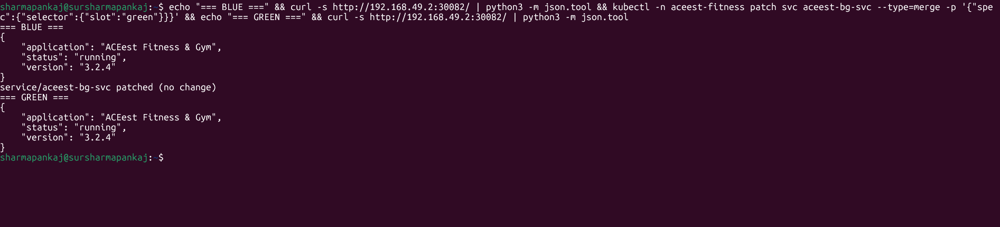

### 4.3 Strategy 3 — Canary Deployment

- **Manifests:** `k8s/canary/` (stable-deployment, canary-deployment, service)
- **Config:** 4 stable replicas (v3.2.4, `track=stable`) + 1 canary replica (v4.0.0, `track=canary`). The service selects on the `app` label only, giving an ~80/20 traffic split by pod ratio.
- **How it works:** A small percentage of traffic is routed to the new version (canary) while the majority continues to hit the stable version. If the canary performs well, it can be promoted by scaling up canary and scaling down stable.

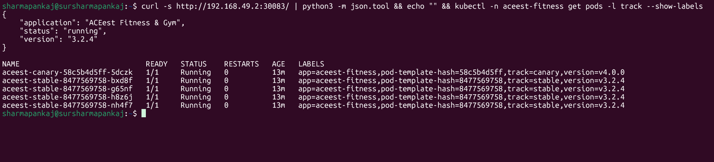

### 4.4 Strategy 4 — A/B Testing

- **Manifests:** `k8s/ab-testing/` (version-a-deployment, version-b-deployment, services, ingress)
- **Config:** Version A (v3.2.4, 3 replicas) and Version B (v4.0.0, 2 replicas) with separate ClusterIP services. NGINX Ingress routes traffic based on the `X-Version: B` header using canary annotations.
- **How it works:** Default requests go to Version A. Requests with the header `X-Version: B` are routed to Version B. This enables targeted feature testing for specific user segments without affecting other users.

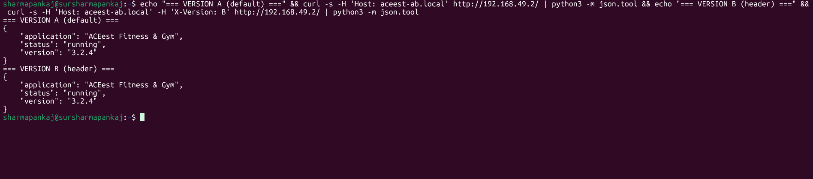

### 4.5 Strategy 5 — Shadow (Traffic Mirroring)

- **Manifests:** `k8s/shadow/` (primary-deployment, shadow-deployment, ingress)
- **Config:** Primary (v3.2.4, 3 replicas) serves real traffic via NodePort 30084. Shadow (v4.0.0, 2 replicas) receives mirrored traffic via NGINX `mirror-target` annotation. Shadow responses are discarded — no user impact.
- **How it works:** Production traffic is duplicated and sent to the shadow deployment for testing. The shadow processes real requests but its responses are discarded, allowing validation against live traffic without any risk to users.

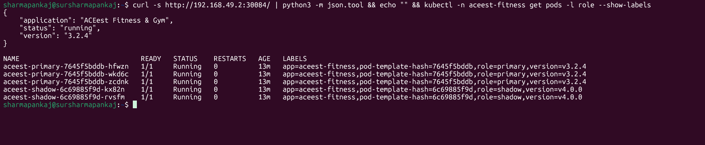

---

## 5. Challenges & Mitigations

| # | Challenge | Mitigation |
|---|-----------|-----------|
| 1 | **ARM64 architecture** — Windows ARM64 machine caused "Exec format error" for amd64 binaries (kubectl, minikube). | Downloaded ARM64-specific binaries for both tools in WSL. |
| 2 | **Minikube on Windows** — Docker-in-Docker TLS handshake failures when running Minikube natively on Windows. | Switched to WSL Ubuntu 24.04 as the Minikube host with the Docker driver. |
| 3 | **Jenkins Python not found** — Default Jenkins LTS image lacks Python. | Installed python3, pip, venv, and docker.io inside the Jenkins container via `apt-get`. |
| 4 | **SonarCloud Quality Gate NONE** — Initial scan returned status NONE, causing pipeline abort. | Changed Quality Gate stage to a script block that only fails on explicit ERROR status. |
| 5 | **Docker socket permissions** — Jenkins container couldn't access Docker daemon. | Added jenkins user to docker group and set `chmod 666` on the Docker socket. |
| 6 | **ErrImageNeverPull in Minikube** — Images built in host Docker were not available inside Minikube's Docker daemon. | Used `minikube image load` to transfer images and set `imagePullPolicy: Never` in all manifests. |

---

## 6. Version Control & Tagging

The project uses Git with annotated tags to track version progression:

| Tag | Description |
|-----|-------------|
| `v1.0.0` | Initial Flask application setup |
| `v2.0.0` | CI/CD pipeline with Jenkins and SonarCloud |
| `v3.0.0` | Docker containerisation and GitHub Actions |
| `v3.2.4` | Kubernetes deployment with 5 strategies |

---

## 7. Repository Structure

```
aceest-fitness-devops/
├── app.py                          # Flask REST API application
├── test_app.py                     # 52 Pytest test cases
├── requirements.txt                # Python dependencies
├── Dockerfile                      # Multi-stage Docker build (non-root)
├── Jenkinsfile                     # Jenkins declarative pipeline
├── sonar-project.properties        # SonarCloud configuration
├── .github/workflows/main.yml      # GitHub Actions CI/CD pipeline
├── k8s/
│   ├── namespace.yaml              # aceest-fitness namespace
│   ├── deployment.yaml             # Base deployment (3 replicas)
│   ├── service.yaml                # Base NodePort service (30080)
│   ├── rolling-update/             # Strategy 1: Rolling Update
│   ├── blue-green/                 # Strategy 2: Blue-Green
│   ├── canary/                     # Strategy 3: Canary
│   ├── ab-testing/                 # Strategy 4: A/B Testing
│   └── shadow/                     # Strategy 5: Shadow/Mirroring
├── screenshots/                    # Evidence screenshots
└── REPORT.md                       # This document
```

---

## 8. Key Outcomes

1. **52 automated tests** with 100% pass rate across unit, integration, and edge case categories.
2. **Dual CI/CD pipelines** — Jenkins for local development feedback, GitHub Actions for cloud-based deployment.
3. **Automated Docker Hub publishing** with semantic versioning (latest, version tag, build number).
4. **5 Kubernetes deployment strategies** demonstrated on Minikube with 28 pods across 10 deployments.
5. **Rollback capability** validated for Rolling Update (`kubectl rollout undo`) and Blue-Green (service selector patch).
6. **Code quality gating** via SonarCloud integrated into both CI pipelines.
7. **Security practices:** non-root Docker user, resource limits on K8s pods, health checks at both container and pod level.

---

## 9. Conclusion

This project demonstrates a production-grade CI/CD pipeline from code commit to Kubernetes deployment. The dual-pipeline approach (Jenkins + GitHub Actions) provides both local and cloud-based automation. Five deployment strategies were successfully implemented and validated, each serving a different use case — from zero-downtime rolling updates to risk-free shadow testing. The pipeline enforces code quality through SonarCloud, ensures reliability through 52 automated tests, and follows security best practices with non-root containers and resource constraints.
